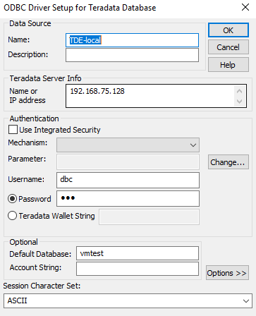

# Profilowanie danych na Teradata
## Przydatne linki
- Teradata (TDExpress16.20_Sles11_20181108052529.7z,
wersja 40Gb http://downloads.teradata.com/download/files/7671/200501/0/TDExpress16.10_Sles11_40GB.7z):
http://downloads.teradata.com/download/database/teradata-express-for-vmware-player
- VMWare:
http://download3.vmware.com/software/player/file/VMware-player-15.0.2-10952284.exe
- Tworzenie tabel
https://downloads.teradata.com/database/articles/teradata-express-14-0-for-vmware-user-guide
- Tworzenie użytkownika
https://docs.teradata.com/reader/u8~Pwz3BmiO8RrPCsqF7bQ/SeSeMcCgpZjIY5~i3Ky8cw
- Python teradata module: https://pypi.org/project/teradata/
- Windows ODBC teradata driver: http://downloads.teradata.com/download/connectivity/odbc-driver/windows

## Inicjalizacja
### Utworzenie użytkownika vmtest
By utworzyć bazę danych vmtest uruchom skrypt ```CREATE_DATABASE.btq```

### Tworzenie tabel w bazie danych
By utworzyć tabele w bazie danych uruchom skrypt ```CREATE_TABLES.btq```
- Pliki z definicjami tabel powinny znajdować się w podkatalogu Tables_Definitions katalogu zawierającego plik ```CREATE_TABLES.btq```

### Usuwanie wszystkich tabel
By usunąć wszystkie tabele z bazy danych uruchom skrypt ```DROP_ALL.btq``` 

### Wstawianie danych do tabeli
Dane ładowane są za pomocą komendy mload (https://www.tutorialspoint.com/teradata/teradata_multiload.htm)

Użycie skryptów: ```mload < “plik ze skryptem”```

Struktura katalogów:
- data_insertion_scripts - katalog ze skryptam mload
- dane_testowe - katalog z plikami dat

Przykład skryptu ładującego dane do tabeli ACC_ICBS_CURRENT_PERIODIC z użyciem mload:
```
.LOGTABLE vmtest.logtable;

.logon 127.0.0.1/dbc, dbc;

   .BEGIN MLOAD TABLES vmtest.ACCOUNT_ICBS_DEPOSIT_PERIODIC;
  	.LAYOUT Data;  
   	 .FIELD in_WH_ACC_NO  * VARCHAR(30) ;
   	 .FIELD in_ACC_NO  * VARCHAR(16) ;
   	 (... SKIPPED ...)
   	 .FIELD in_LOAD_DTE  * VARCHAR(30) ;
   	 .FIELD in_LOAD_TIME * VARCHAR(30);

  	.DML LABEL DataLabel;
  	INSERT INTO vmtest.ACCOUNT_ICBS_DEPOSIT_PERIODIC
  	VALUES (
   	 :in_WH_ACC_NO  ,
   	 :in_ACC_NO  ,
   	 (... SKIPPED ...)
   	 :in_LOAD_DTE  ,
   	 :in_LOAD_TIME
  	);
  	.IMPORT INFILE ../dane_testowe/ACCOUNT_ICBS_DEPOSIT_PERIODIC_DATA_FILE.dat
  	FORMAT VARTEXT ''
  	LAYOUT Data
  	APPLY DataLabel;  
   .END MLOAD;  
LOGOFF;
```

### Miary dla poszczególnych typów
```
ONCE: COUNT(*) as record_count
I, F, D: record_count-COUNT(%col%) AS %col%_nulls, COUNT(DISTINCT %col%) AS %col%_distincts, MIN(%col%) %col%_minimum, MAX(%col%) as %col%_maximum, SUM(%col%) as %col%_sum, ROUND(STDDEV_POP(%col%), 2) as %col%_standard_deviation, AVG(%col%) as %col%_mean
CV:  record_count-COUNT(%col%) AS %col%_nulls, COUNT(DISTINCT %col%) AS %col%_distincts, SUM(CASE %col% WHEN '' THEN 1 ELSE 0 END) AS %col%_empties, SUM(CASE TRIM(%col%) WHEN '' THEN 1 ELSE 0 END) AS %col%_blanks, AVG(LENGTH(%col%)), MIN(LENGTH(%col%)), MAX(LENGTH(%col%))
CF, BF, BV: record_count-COUNT(%col%) AS %col%_nulls, COUNT(DISTINCT %col%) AS %col%_distincts
```

### Pobieranie wszystkich nazw kolumn wraz z typami
By pobrać wszystkie kolumny wraz z typami uruchom skrypt ```SHOW_ALL_TABLES.btq```

## Wykonywanie programu
### Przygotowanie (windows)
Jesli maszyna TeraData jest juz uruchomiona i odpowiednio skonfigurowana, mozemy przystapic do konfiguracji polaczenia z maszyna wirtualna.
W tym celu nalezy najpierw zainstalowac sterownik ODBC TeraData (link u gory).

### Zestawianie polaczenia
Po zainstalowaniu wykonujemy nastepujące kroki:
- Uruchom aplet Administrator ODBC
- Aby dodać nowe połączenie liknij "Dodaj"
- Z listy wybierz Teradata Database ODBC Driver i klinij "Zakończ"
- Wypełnij pola kreatora
* W polu "Name" wpisz nazwe swojego polaczenia (pamietaj, aby zgadzla sie ona z konfiguracja w pliku `udaexec.ini`.
* W polu "Name or IP address" wpisz adres IP swojej maszyny wirtualnej Teradata
* Uzupełnij pola "Username" i "Password"
Przykładowa konfiguracja:



- klinkij "OK' aby zakonczyc konfiguracje

### Uruchamianie skryptu
Jesli konfiguracja jest poprawna skrpyt powinien wykonac sie bez problemu po wpisaniu ponizszej komendy:

```python app.py```

Aby wyswietlic liste dostepnych parametrow, wpisz:

```python app.py --help```

Przykładowe uruchomienie dla bazy danych `vmtest` dla wszytskich tabel, z zapisaniem wyników do pliku `full_profile.csv`:

```python app.py -d vmtest -o full_profile.csv```

Wyniki wywołania tego polecenia na instancji VMWare z przydzielonym 1 rdzeniem procesora (Intell Core i5 4210H) i 8GB pamięci RAM:

[full_profile.csv](full_profile.csv)

[full_profile.stdout](full_profile.stdout)
